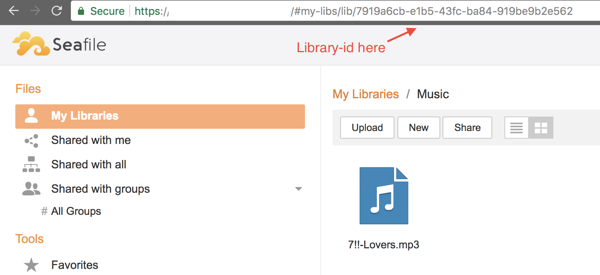

# docker-seafile-client
Run a seafile client inside docker which can sync files from seafile repositories

See docker-compose how to use.

## Environment variables:
 - LIBRARY_ID=your-library-id-here   Can be multiple library ids seperated with colon :
 - SERVER_URL=server-url             The url used to access your server, eg: https://example.seafile.com
 - SERVER_PORT=server-port           Which port the server is hosted on: usually 443 (https) or 80 (http)
 - USERNAME=username                 Your account username (credentials)
 - PASSWORD=password                 Your account password (credentials)
 - DATA_DIR=directory-path-to-sync   The path where to put the files

## How to find library id:

